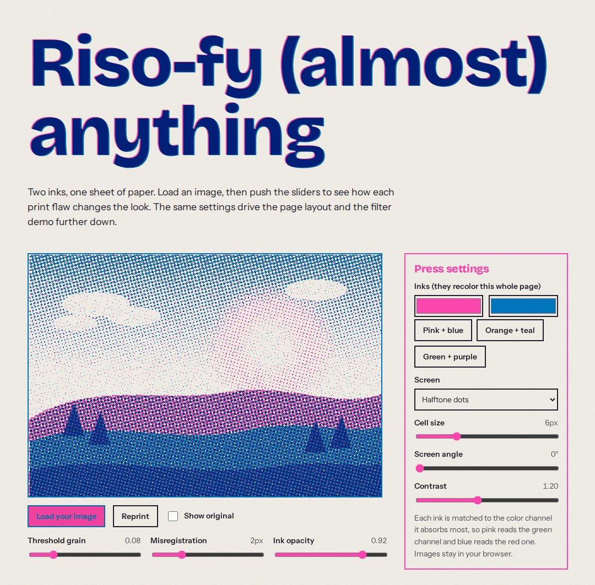
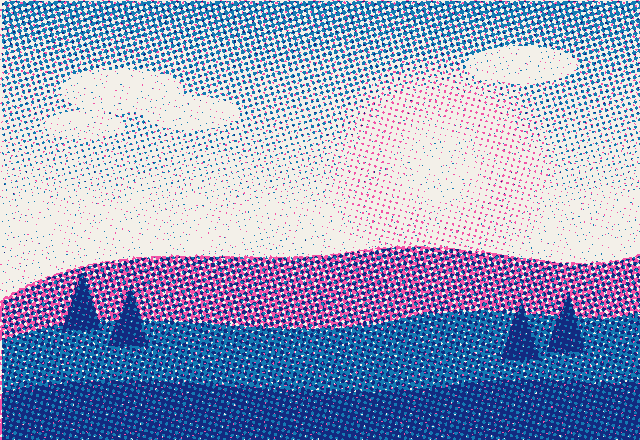
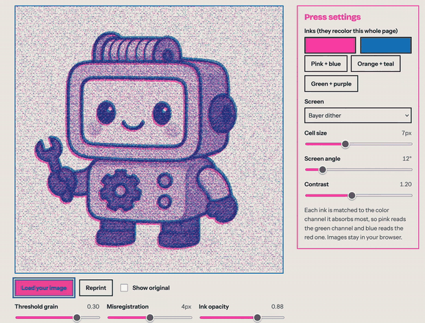
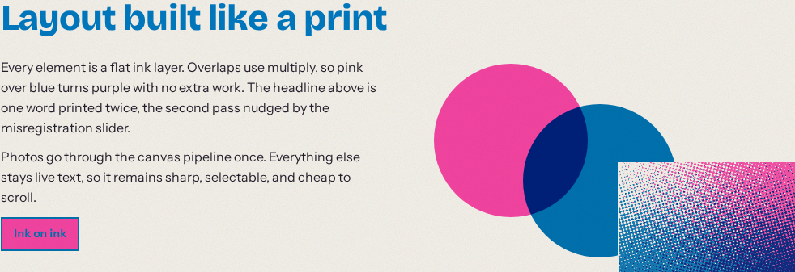
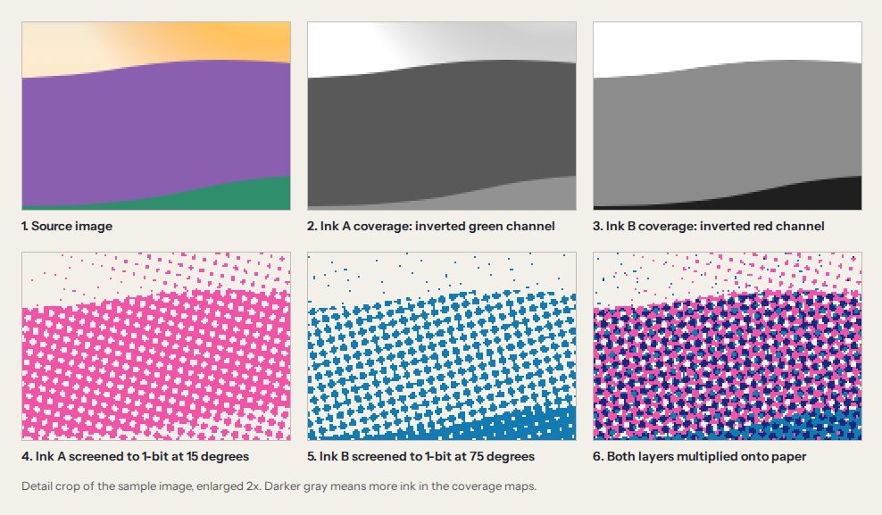
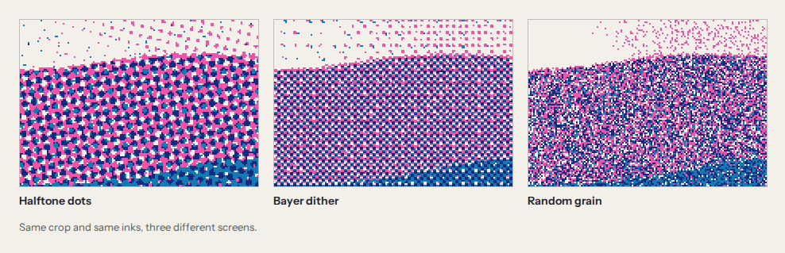
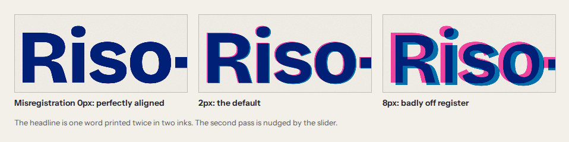
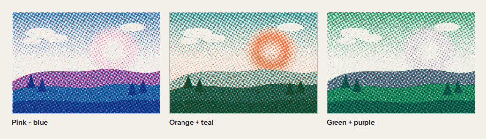
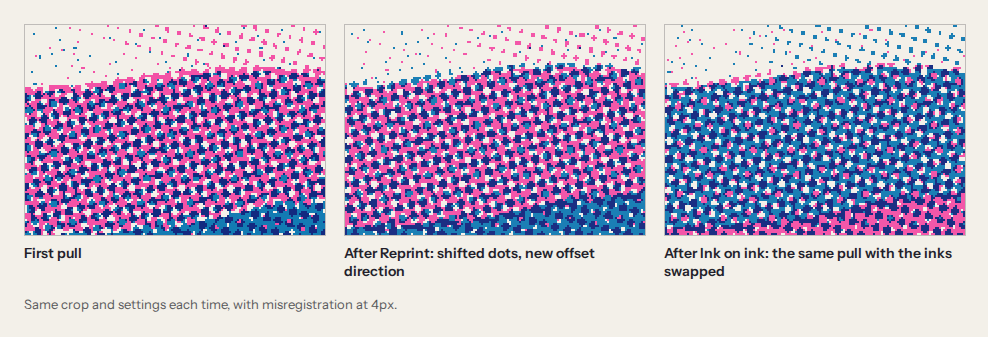
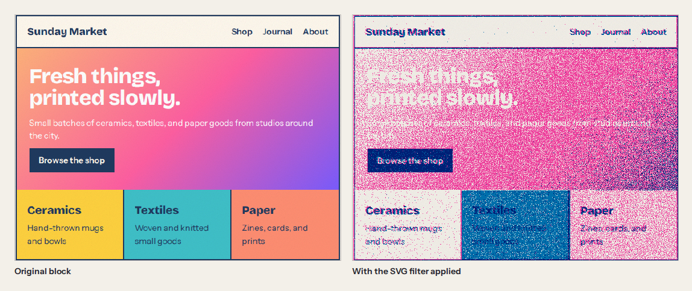

# Fluoro

[](https://www.npmjs.com/package/fluoro-riso)

Riso-fy (almost) anything.



Fluoro is a small toolkit for faking risograph prints in the browser. It rebuilds the print process instead of applying a filter: split an image into one layer per ink, turn each layer into a 1-bit screen, then overprint the layers on paper with a little misregistration and grain.

You can use it two ways: as a tool at [fluoro-riso.vercel.app](https://fluoro-riso.vercel.app) for riso-fying your own images, or as a package that adds a Riso-fy button to any website with one line of HTML. The tool has no build step, and the package has no dependencies.

```html
<script src="https://cdn.jsdelivr.net/npm/fluoro-riso" defer></script>
```

See [Add it to your site](#add-it-to-your-site) for options, npm, and React.

<table>
  <tr>
    <td><br>Before</td>
    <td><br>After: pink + blue, halftone dots, 2px misregistration</td>
  </tr>
</table>



## Contents

- [Run it](#run-it)
- [Three ways to get the look](#three-ways-to-get-the-look)
- [Add it to your site](#add-it-to-your-site)
- [How the canvas pipeline works](#how-the-canvas-pipeline-works)
- [How the SVG filter works](#how-the-svg-filter-works)
- [The process behind it](#the-process-behind-it)
- [Settings](#settings)
- [Project structure](#project-structure)
- [Limits](#limits)
- [Ideas](#ideas)

## Run it

Open `index.html` in a browser. The scripts are plain classic scripts, so it works from `file://`.

To work on the package too, run `npm install` once, then `npm run dev` and open http://127.0.0.1:5173. That serves the site and rebuilds `dist/fluoro.js` on every reload, so changes in `src/` show up without running the bundle by hand. Fonts load from Google Fonts and fall back to system fonts when offline.

Use **Load your image** to try your own photo. Images are downscaled to 640px on the long side and never leave the browser.

## Three ways to get the look

The page demonstrates three approaches side by side, all driven by the same inks and settings.

| Approach | Where | Best for | Trade-off |
| --- | --- | --- | --- |
| Canvas pipeline | `js/pipeline.js` | Images: real halftone dots, dither, exportable layers | Static output, computed per pixel |
| CSS as a print | `css/styles.css` | Your own site: live text, cheap to scroll | Only covers what you build with it |
| SVG filter | `js/filter.js` | Riso-fying markup you did not build | Re-runs on every repaint, grain instead of dots |

The CSS approach treats every element as a flat ink layer. Overlaps use `mix-blend-mode: multiply`, so pink over blue turns a deep indigo with no extra work.



## Add it to your site

Fluoro is on npm as [`fluoro-riso`](https://www.npmjs.com/package/fluoro-riso). It can print a whole page, chosen sections, or single images, and it works on sites you didn't build with it.

### With a script tag

No install needed. Paste this before the closing `</body>` tag:

```html
<script src="https://cdn.jsdelivr.net/npm/fluoro-riso" defer></script>
```

A Riso-fy button appears in the bottom-right corner. Clicking it prints the page in two inks, and clicking Show original restores it. The choice is remembered on the next visit. Text stays live, so links, forms and text selection keep working while the page is printed.

Settings go on the script tag as attributes:

| Attribute | What it does | Example |
| --- | --- | --- |
| `data-inks` | Picks an ink preset: `pink-blue` (default), `orange-teal` or `green-purple`. | `data-inks="orange-teal"` |
| `data-ink-a`, `data-ink-b` | Sets each ink to any color, overriding the preset. | `data-ink-a="#ff48b0"` |
| `data-paper` | Sets the paper color. | `data-paper="#fdf6e3"` |
| `data-grain` | Sets the grain strength. The default is `1.5`. | `data-grain="1"` |
| `data-misregistration` | Sets how far the second ink is offset, in pixels. The default is `2`. | `data-misregistration="4"` |
| `data-mode` | `"lite"` uses the fast blend-layer print instead of the SVG filter. See [Lite mode](#lite-mode). | `data-mode="lite"` |
| `data-target` | Prints only the elements matching a CSS selector instead of the whole page. | `data-target=".hero"` |
| `data-button` | `"false"` hides the corner button, so you can use your own. | `data-button="false"` |

To use your own button, hide the default one and call `Fluoro.toggle()`:

```html
<button type="button" onclick="Fluoro.toggle()">Print this page</button>
<script src="https://cdn.jsdelivr.net/npm/fluoro-riso" data-button="false" defer></script>
```

The corner button is styled at zero specificity, so any rule for `.fluoro-button` in your own CSS overrides it.

To lock a version so updates never change your site, add it to the URL: `https://cdn.jsdelivr.net/npm/fluoro-riso@0.1`.

### With npm

```sh
npm install fluoro-riso
```

```js
import { apply, remove, toggle, printImage } from "fluoro-riso";

// print the whole page, or only some elements
apply({ inkA: "#ff6c2f", inkB: "#00838a" });
apply({ target: ".hero" });

// print an image with real halftone dots; returns a canvas
const print = printImage(document.querySelector("img"), { screen: "halftone", cell: 6 });
```

In React or Next.js, call it from a client component:

```jsx
"use client";

import { toggle } from "fluoro-riso";

export default function RisoButton() {
  return (
    <button type="button" onClick={() => toggle()}>
      Riso-fy
    </button>
  );
}
```

The package doesn't touch the page until you call it, so importing it during server rendering is safe.

| Export | What it does |
| --- | --- |
| `apply(options)` / `remove(options)` / `toggle(options)` | Print or restore the whole page, or a `target` selector or element. |
| `isOn()` / `onChange(fn)` | Read whether the page is printed, or get called with `true` or `false` when it changes. |
| `createButton(options)` | A ready-made toggle button. `remember: false` stops it saving the choice. |
| `buttonStyles(options)` | Default CSS for that button. |
| `printImage(source, options)` | Runs the canvas pipeline on an image, canvas or video frame. |
| `filterMarkup(options)` / `svgMarkup(options)` | The SVG filter as a string, with no DOM access, for server rendering or custom setups. |
| `applyLite(options)` / `removeLite()` | Lite mode on its own, without the page state. |
| `INKS` / `PAPER` | The ink presets and the default paper color. |

Options use the same names as the script-tag attributes, in camel case: `inkA`, `inkB`, `paper`, `grain`, `misregistration`, `mode` and `target`.

### Lite mode

The default print runs an SVG filter over the page, which gives real 1-bit separations but re-runs on every repaint, so long or animated pages can scroll slowly. Lite mode lays three fixed blend layers over the page instead: it pushes the midtones toward ink A, turns the darks into the overprint color of both inks, and puts everything on paper with a scatter of ink A grain. Nothing on the page is filtered, and all three blend modes run on the GPU, so scrolling stays fast and fixed headers keep working in every browser.

```js
apply({ mode: "lite" });
```

Lite mode is a tint rather than a true separation, so it has no misregistration or halftone dots. Anything with a `z-index` above `2147482000` sits above the layers and stays unprinted, which is how the Riso-fy button stays in its own colors; a site's own toggle button can do the same. Lite options: `inkA`, `inkB`, `paper`, `mids` (how strongly the midtones take ink A, default `0.7`), `grain` (speck density, default `0.05`), `desaturate` and `zIndex`.

`desaturate: true` adds a fourth layer that strips the page's own colors first, which helps very colorful sites print cleanly in two inks. It uses the `saturation` blend mode, which Safari draws in software, so leave it off on long or animated pages.

### Browser support

Printing a whole page works in all current browsers, but how it handles fixed elements differs:

| Browser | What gets printed | Fixed headers and sticky elements |
| --- | --- | --- |
| Chrome, Edge, Arc, Brave | The whole page, from the root element | Stay fixed and are printed too |
| Safari, Firefox, Zen, and all iOS browsers | The page body | Scroll with the page while it is printed, and some fixed or animated elements keep their original colors |

The difference comes from how browsers draw fixed elements: Safari and Firefox drop a filter on the root element when the page contains one, so outside Chrome-based browsers Fluoro prints the body and keeps its own button outside it.

`printImage` can only read images from your own site, or from other sites that send CORS headers. The page filter works on everything the browser draws.

## How the canvas pipeline works



1. **Pick two inks.** Each ink is matched to the color channel it absorbs most, which is the lowest value in its RGB. Pink reads the green channel and blue reads the red one. If both inks pick the same channel, the second takes the next one.
2. **Build a coverage map per ink.** The chosen channel is inverted so 1 means full ink, then a contrast curve is applied. This is stage 2 and 3 in the figure.
3. **Screen each map to 1-bit.** A pixel gets ink when its coverage is higher than a threshold. The threshold comes from a rotated dot screen, a Bayer matrix, or noise, plus a little seeded grain. Ink A uses 15 degrees and ink B uses 75 degrees so the dots do not fight each other.
4. **Overprint.** Each layer is painted in its ink color and drawn onto a paper-colored canvas with `multiply`, at ink opacity below 1, with the second ink offset by the misregistration amount.

### Screens



Halftone dots give the classic newsprint look. Bayer dither is regular and pixel-like, and it is the closest to the style of a dithering tool. Random grain is the roughest and reads like a worn stencil.

### Misregistration



On a real riso machine each color is a separate pass, so the sheet never lines up perfectly. The offset is the cheapest way to make the result feel printed. The headline on the page is built the same way: one word printed twice, with the second pass nudged by the slider.

### Inks decide what survives



Two inks can only reach the colors between them. With pink and blue the sun almost disappears, because orange and yellow have very little green or red to absorb. Orange and teal brings it back. Changing the inks is the biggest single change to a print.

### Reprint and ink swap



Reprint pulls another print from the same settings. It draws new grain, shifts each dot screen, picks a new misregistration direction and varies the ink density slightly, the way two pulls off a real press never match. Ink on ink swaps the two inks and which plate each one prints, so pink and blue trade places in the image and across the page.

## How the SVG filter works



The filter does the same separation inside the browser's filter pipeline, so it works on any markup. For each ink it:

1. inverts the channel the ink absorbs with `feColorMatrix`,
2. adds `feTurbulence` noise with `feComposite`,
3. thresholds to 1-bit with a discrete `feComponentTransfer`,
4. tints the result with the ink color and offsets the second ink with `feOffset`.

The two layers are then multiplied onto a `feFlood` paper color with `feBlend`. The filter is rebuilt from the current inks whenever a setting changes, and it produces grain rather than true halftone dots.

## The process behind it

### Starting point

[p5.riso](https://github.com/antiboredom/p5.riso) already exists and is a good tool. This project started from the wish to own the whole pipeline and to build it in the same spirit as my other image tools, Punch Card Studio (coming soon) and Pixel Picnic: paste in or load an image, get a physical-feeling result, keep every step visible. The second question was whether the same effect could be applied to a whole website.

### Treating riso as a process

Instead of chasing a look, the build follows what the machine does. Each part of a real print maps to one part of the code:

| On the press | In Fluoro |
| --- | --- |
| One master (stencil) per ink | One coverage map per ink |
| A master is either ink or no ink | Screening to 1-bit |
| Screens at different angles avoid moire | 15 and 75 degrees |
| The sheet passes through once per color | Layers are drawn one after another |
| Translucent inks mix where they overlap | `multiply` blending |
| The sheet never registers perfectly | Misregistration offset |
| Uneven ink density and paper texture | Ink opacity below 1, threshold grain, paper grain overlay |

### Three options for riso-fying a website

An SVG filter is the fastest to apply to something you did not build, but it is heavy and only gives grain. Treating riso as a design language in CSS keeps text sharp and fast, but it only works on pages you control. Rendering the page to a canvas and running the image pipeline gives the best print quality, but the result is static. The page demonstrates all three, with CSS for the layout, the canvas pipeline for images, and the filter as an accent on one block. The demo block is a good example of the filter's limits.

### Decisions and gotchas

- **A channel heuristic instead of a color solve.** Solving each pixel as a mix of arbitrary inks is more accurate, but matching each ink to the channel it absorbs already looks right and keeps the code short.
- **Multiply is the step that matters.** Without it the layers just cover each other. With it, overlaps darken the way translucent ink does.
- **Seeded noise.** The grain is generated once per image and per Reprint, so dragging a slider does not make the print flicker.
- **One settings object.** The DOM, the CSS variables, the canvas and the filter all read the same state, so changing an ink recolors the whole page.
- **Only the pixels that need it are processed.** Images and the filter demo go through the pipeline. Everything else stays live text.
- **Two inks cannot reach every color.** Yellow drops out with pink and blue, which is visible in the filter figure where the yellow tile turns to paper. A third ink would fix this.
- **Busy backgrounds hurt legibility.** Light text on a noisy field gets speckled by the filter. The canvas pipeline is the better tool for photos, the filter is the better tool for accents.

### How it was checked

The code was exercised in a headless DOM with a stubbed canvas, driving every slider, screen, preset and toggle. All screenshots and figures in `docs/images` were captured from the running page in headless Chromium, and the pipeline figures were produced by calling the page's own functions, so they show the real output. The package's page printing was checked in headless Chromium and WebKit, and by hand in Chrome, Safari and Zen.

## Settings

| Setting | What it does |
| --- | --- |
| Inks | Two color pickers and three presets. They also recolor the whole page. |
| Screen | Halftone dots, Bayer dither, or random grain. |
| Cell size | Size of one halftone cell or dither step. |
| Screen angle | Rotates both halftone screens. |
| Contrast | Steepens or flattens each coverage map. |
| Threshold grain | Noise added to the threshold. It has no effect in random grain mode. |
| Misregistration | Pixel offset of the second ink. Also drives the headline and the filter. |
| Ink opacity | Alpha of each layer before multiply. |
| Reprint | Pulls another print: new noise, shifted screens, a new misregistration direction and slightly different ink density. |
| Ink on ink | The button in the layout section. Swaps the two inks and which plate each one prints, so pink and blue trade places in the image and on the page. Press it again to swap back. |
| Show original | Shows the source image instead of the print. |
| Filter grain | Noise strength in the SVG filter demo. |

## Project structure

```
index.html        markup for the press panel, the layout demo and the filter demo
css/styles.css    riso layout styles and page chrome
js/util.js        element lookup, color math, seeded noise
js/state.js       the shared settings object
js/screens.js     Bayer matrix and the rotated dot screen
js/pipeline.js    ink layers (screen to 1-bit) and multiply compositing
js/scene.js       built-in sample image, drawn with canvas paths
js/filter.js      SVG filter builder
js/app.js         source image, rendering, controls, wiring
src/              the fluoro-riso package: filter, print pipeline, page toggle
src/auto.js       entry for the script-tag build
dist/fluoro.js    script-tag build, made with npm run bundle
docs/images/      screenshots and figures used in this README
```

Scripts load in the order listed in `index.html` and share global scope, so keep that order when adding files.

## Limits

- The SVG filter re-runs on every repaint, so long pages with many animations can scroll less smoothly while printed. Use [lite mode](#lite-mode), or `target` to print only some sections, if that happens.
- Outside Chrome-based browsers, fixed headers scroll with the page while it is printed. See [Browser support](#browser-support).
- The filter produces grain rather than true halftone dots. Use the canvas pipeline when you need dots.
- Two inks cannot reproduce every color. Pick inks that suit the image.

## Ideas

- Export each separation as a black 1-bit PNG at 300 or 600 dpi for real riso printing.
- Add a third ink layer.
- Browser extension that injects the filter into any page.
- Move the site onto the package so both share one copy of the pipeline.
- Pick a palette from the image (k-means) instead of using presets.
